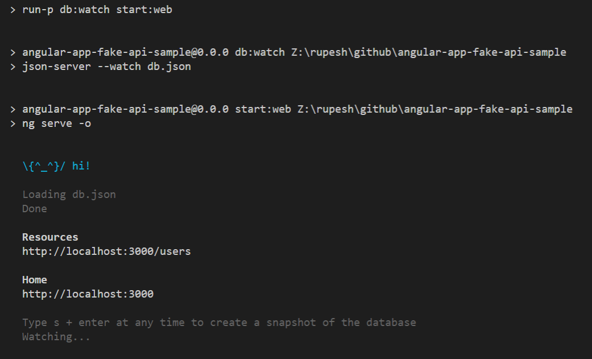

# AngularAppFakeApiSample

This project is demonstrating how can we focus on developing angular project without worrying about the API.
We can use `json-server` node package to host a fake api with JSON data written in `db.json` file placed right in the root folder of your project. This gives us lots of opportunity to work on angular project and not to worry how to host webapi etc.

When you will run `npm start` I run the `db:watch` script which host webapi and create an friendly url (http://localhost:3000/users) to use in my project.

## Development server

Run `npm start` for a dev server. Navigate to `http://localhost:4200/`. The app will automatically reload if you change any of the source files.

### Start CLI

### Users Can be seen after running start

## Build

Run `npm run build` to build the project. The build artifacts will be stored in the `dist/` directory. Use the `--prod` flag for a production build.

## Running unit tests

Run `npm test` to execute the unit tests via [Karma](https://karma-runner.github.io).

### Test CLI

### Test Passing

## Running end-to-end tests

Run `npm run e2e` to execute the end-to-end tests via [Protractor](http://www.protractortest.org/).
